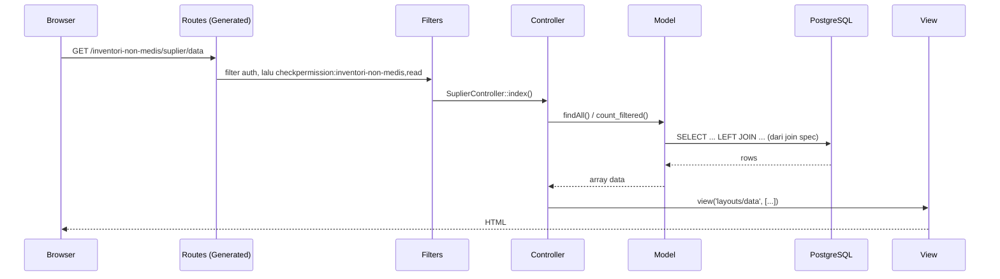

# Architecture


Dokumen ini menjelaskan arsitektur **Core** Omnia: bagaimana satu request diproses dari route sampai render HTML, dan pola yang harus diikuti setiap modul (**Feature**) supaya konsisten. Setiap anggota tim bertanggung jawab atas kelompok modul yang berbeda, tapi semuanya dibangun di atas Core yang sama - dokumen ini adalah kontrak bersama itu.

## Daftar Isi

1. [Gambaran Umum](#gambaran-umum)
2. [Struktur Direktori](#struktur-direktori)
3. [Alur Satu Request](#alur-satu-request)
4. [Database Layer](#database-layer)
5. [Model Layer](#model-layer)
6. [Controller Layer](#controller-layer)
7. [Route Layer](#route-layer)
8. [Autentikasi & Otorisasi](#autentikasi--otorisasi)
9. [View Layer](#view-layer)
10. [Audit & Enkripsi Kolom (Opsional)](#audit--enkripsi-kolom-opsional)
11. [Spark Commands (`omnia:*`)](#spark-commands-omnia)
12. [Menambah Modul Baru](#menambah-modul-baru)
13. [Referensi](#referensi)

## Gambaran Umum

Omnia memakai pola **Core + Feature**:

- **Core** (`app/Core/`) - kelas dasar/generik yang dipakai semua modul: `DatabaseTemplate`, `ModelTemplate`, `ControllerTemplate`, `RouteTemplate`. Kode di sini tidak boleh tahu apa-apa soal modul spesifik (Barang, Suplier, Registrasi, dst).
- **Feature** (`app/Features/<Grup>/<Modul>/`) - satu folder per modul, isinya *hanya* deklarasi data lewat 4 kelas: `*Database.php`, `*Model.php`, `*Controller.php`, dan (untuk grup) `*Routes.php`. Modul menurunkan (extends) kelas Core dan mengisi konfigurasinya lewat constructor - jarang menulis logika baru.

Karena hampir semua modul CRUD (Barang, Suplier, Registrasi, Permintaan, dll.) punya bentuk yang sama - tabel dengan foreign key, form tambah/ubah, daftar dengan paginasi - Core menyediakan implementasi CRUD generik satu kali, dan tiap modul cukup **mendeklarasikan schema kolom + relasi**. Ini yang membuat satu orang bisa mengerjakan puluhan modul (lihat jumlah folder di `app/Features/`) tanpa menulis controller CRUD dari nol setiap kali.

Modul yang perilakunya menyimpang dari CRUD generik (butuh query custom, view custom, validasi tambahan) meng-override method tertentu di kelas Core lewat *hook* (`before_create`, `after_read`, dsb.) atau override total (`create_view`, `update_page`) - lihat [Menambah Modul Baru](#menambah-modul-baru).

## Struktur Direktori

```
app/
├── Core/
│   ├── Auth/            Role & AccessMatrix (hak akses baca/tulis per grup fitur)
│   ├── Commands/        spark command omnia:route, omnia:sidebar, omnia:icon, omnia:audit, omnia:encrypt
│   ├── Config/          KhanzaMigrationRunner (urutan migration berdasar dependencies())
│   ├── Controller/      ControllerTemplate, ActionType, InputType, AuthController, ErrorController
│   ├── Database/
│   │   ├── Template/    DatabaseTemplate, SemanticType, ForgeType, PostgresType, Migration
│   │   ├── Special/     InitDatabase, AuditDatabase, EncryptDatabase, SearchPathDatabase
│   │   ├── Audit/        *.sql - script PL/pgSQL untuk trigger audit
│   │   └── Encrypt/       *.sql - script PL/pgSQL untuk enkripsi kolom
│   ├── Model/           ModelTemplate, ValidationType
│   └── Route/           RouteTemplate, RouteGroup
├── Features/
│   ├── AllRoutes.php    daftar semua *Routes.php (satu per grup fitur)
│   └── <Grup>/
│       ├── <Grup>Routes.php     daftar modul dalam grup + icon .svg
│       └── <Modul>/
│           ├── <Modul>Database.php   schema tabel, FK, seed CSV
│           ├── <Modul>Model.php      field & join spec untuk tampilan relasi
│           ├── <Modul>Controller.php konfigurasi kolom, actions, hook custom
│           └── <modul>.csv           data dummy/seed (opsional)
├── Filters/             Auth (wajib login), CheckPermission (baca/tulis per grup)
├── Views/
│   ├── layouts/         data.php (list), tambah_ubah.php (form), audit.php
│   └── components/      tabel/, popup/, form/, modal/, aksi/, cetak/, tracking/
└── Config/
    ├── Routes.php               memuat GeneratedRoutes.php di baris terakhir
    ├── GeneratedRoutes.php       hasil `php spark omnia:route` (jangan edit manual)
    └── GeneratedSidebar.php      hasil `php spark omnia:sidebar` (jangan edit manual)
```

## Alur Satu Request

Contoh: `GET /inventori-non-medis/suplier/data`



1. **Route** - `GeneratedRoutes.php` (hasil `php spark omnia:route`) mencocokkan URI ke method controller. Path dibentuk otomatis dari nama kelas: grup fitur & judul modul di-*kebab-case*-kan (`RouteGroup::create_path_from_name()`).
2. **Filter** - tiap route grup fitur dibungkus filter `auth` (harus login) lalu tiap route individu dijaga `checkpermission:<group_path>,read|write`.
3. **Controller** - `ControllerTemplate` menjalankan CRUD generik: ambil data dari Model, susun konfigurasi kolom, render view.
4. **Model** - `ModelTemplate` membangun query (dengan JOIN kalau modul punya relasi) ke PostgreSQL lewat koneksi database aplikasi (`khanza_db`).
5. **View** - hasil dirender lewat template Blade-like CodeIgniter (`layouts/data.php`, dsb.) yang men-generate tabel, form, dan popup detail secara generik dari konfigurasi kolom.

## Database Layer

`App\Core\Database\Template\DatabaseTemplate` (extends `CodeIgniter\Database\Migration`) adalah dasar setiap `*Database.php`. Constructor menerima seluruh definisi tabel secara deklaratif:

```php
final class BarangDatabase extends DatabaseTemplate
{
    public function __construct()
    {
        parent::__construct(
            'inventori_non_medis',              // schema
            'barang',                            // table
            [                                    // kolom: nama => SemanticType
                'id_barang'       => T::ID(2_000),
                'kode_barang'     => T::CODE(10),
                'nama_barang'     => T::NAME(100),
                'id_satuan'       => T::FK_AUTO(),
                'id_jenis_barang' => T::FK_AUTO(),
                'stok'            => T::QTY(0, 1_000_000),
                'stok_minimum'    => T::QTY(0, 1_000_000)->nullable(),
                'harga_satuan'    => T::MONEY()->nullable(),
            ],
            'id_barang',                          // primary key
            ['kode_barang'],                       // unique key
            [                                      // foreign keys: [kolom, kelas Database referensi, kolom referensi]
                ['id_jenis_barang', JenisBarangDatabase::class, 'id_jenis_barang'],
                ['id_satuan', SatuanDatabase::class, 'id_satuan'],
            ],
            true,           // data_is_real: true kalau tabel diisi data sungguhan (bukan cuma ref/lookup)
            'barang.csv',   // file seed, relatif terhadap folder modul
        );
    }
}
```

Poin penting:

- **`SemanticType`** (alias `T`, `app/Core/Database/Template/SemanticType.php`) adalah katalog tipe kolom bermakna bisnis (`ID`, `CODE`, `NAME`, `MONEY`, `QTY`, `DATE`, `FILE`, dst.), bukan tipe SQL mentah - tujuannya supaya semua modul memakai representasi yang konsisten (mis. semua kolom uang selalu `NUMERIC(16,4)`). Di baliknya dipetakan ke `PostgresType`/`ForgeType`.
- **`T::FK_AUTO()`** artinya tipe kolom FK "menyalin" tipe kolom yang dirujuk secara otomatis (`DatabaseTemplate::set_fk_auto()`) - kamu tidak perlu tahu/mengetik ulang tipe primary key tabel lain.
- **Foreign key** otomatis membuat constraint FK di `up()` lewat `Forge::addForeignKey()`, dan `dependencies()` memberi tahu `KhanzaMigrationRunner` urutan migrasi yang benar (tabel yang dirujuk harus dibuat lebih dulu).
- **Seed CSV** (`'barang.csv'`) di-`COPY ... FROM STDIN` ke tabel **hanya sekali**, saat migration pertama kali membuat tabel (`up()` → `seed()`). Mengubah file CSV **tidak** memengaruhi tabel yang sudah ada di database yang sudah pernah di-migrate - kalau ingin data lama ikut berubah, update juga baris di database secara langsung (`psql`) atau jalankan ulang migrasi dari awal.
- Tabel database aplikasi (`khanza_db`) dipisah dari database "admin" (koneksi awal) - lihat penjelasan di [DEPLOYMENT.md](DEPLOYMENT.md#environment-variables). `InitDatabase` (`app/Core/Database/Special/InitDatabase.php`) yang membuat database `khanza_db` ini serta menjalankan `migration.sql`/`function.sql` dasar sebelum migration modul-modul lain berjalan.

## Model Layer

`App\Core\Model\ModelTemplate` (extends `CodeIgniter\Model`) menerima referensi ke `*Database` beserta dua hal tambahan:

```php
final class SuplierModel extends ModelTemplate
{
    public function __construct()
    {
        parent::__construct(
            new SuplierDatabase(),
            [                                    // field non-relasi (hanya penanda, allowedFields)
                'id_suplier'   => V::DEFAULT(),
                'kode_suplier' => V::DEFAULT(),
                'nama_suplier' => V::DEFAULT(),
                'no_telp'      => V::DEFAULT(),
                'alamat'       => V::DEFAULT(),
            ],
            [                                    // join spec: kolom FK => kolom yang mau ditampilkan dari tabel rujukan
                'id_kota'     => ['nama_kota'],
                'id_rekening' => [
                    'nomor_rekening',
                    'nama_akun',
                    'bank' => ['nama_bank'],       // bisa nested lewat FK di tabel rujukan
                ],
            ],
        );
    }
}
```

**Join spec** adalah bagian paling penting untuk dipahami:

- Key-nya adalah nama kolom FK di tabel modul ini (harus cocok dengan salah satu foreign key yang dideklarasikan di `*Database.php`).
- Value-nya daftar kolom yang ingin ditampilkan dari tabel yang dirujuk. Bisa nested (`'bank' => ['nama_bank']`) kalau tabel rujukan punya FK lagi ke tabel lain.
- `findAll()` dan `find_one()` (override di `ModelTemplate`) otomatis mem-`LEFT JOIN` **semua** entri di `$join` - lepas dari kolom mana yang benar-benar dipakai controller. Artinya menghapus baris field di Controller (karena dianggap duplikat/tidak perlu ditampilkan) **tidak pernah** menghilangkan data yang tersedia untuk join lain.
- **Konflik nama kolom**: kalau dua join berbeda menghasilkan kolom leaf dengan nama sama (mis. dua FK yang sama-sama berujung ke `nama`), kemunculan **pertama** (urutan array `$join` di Model) memakai alias polos, kemunculan berikutnya di-alias `{root_fk}_{kolom}` (`ModelTemplate::select_once()` / `compute_leaf_aliases()`). `ControllerTemplate::build_modular_columns()` memakai `compute_leaf_aliases()` yang sama supaya nama kolom yang dideklarasikan di Controller (`FORM_ONLY, ..., 'petugas_nama', ...`) cocok dengan alias hasil query.
- `V::DEFAULT()` dkk. (`ValidationType`) hanya dipakai untuk membangun `allowedFields`; validasi aturan panjang string (`max_length`) sebenarnya diturunkan otomatis dari `constraint` tiap kolom `*Database.php`, bukan dari sini.
- `get_all_options()` menyediakan pasangan (label, value) untuk dropdown/select berdasarkan join spec yang sama - dipakai `get_fields_with_options()` di Controller untuk field `InputType::SELECT`.

## Controller Layer

`App\Core\Controller\ControllerTemplate` (extends `CodeIgniter\Controller`) adalah tempat CRUD generik hidup: `index()`, `create()`, `update()`, `delete()`, `audit()`, `print()`, `tampil()` (serve file upload). Modul mengonfigurasinya lewat constructor:

```php
final class SuplierController extends ControllerTemplate
{
    public function __construct()
    {
        parent::__construct(
            new SuplierModel(),
            [                                    // breadcrumb
                ['Inventori Non Medis', 'inventori_non_medis'],
                ['Suplier', 'suplier'],
            ],
            'Suplier',                            // judul modul (dipakai di breadcrumb, judul halaman, path route)
            [A::READ, A::CREATE, A::UPDATE, A::DELETE], // actions yang tersedia
            [                                     // fields: [visibilitas, wajib?, tipe input, kolom, label, opsi?]
                [HIDE,       OPTIONAL, I::INDEX,  'id_suplier',   'ID Suplier'],
                [SHOW,       REQUIRED, I::TEXT,   'kode_suplier', 'Kode Suplier'],
                [SHOW,       REQUIRED, I::NAME,   'nama_suplier', 'Nama Suplier'],
                [FORM_ONLY,  OPTIONAL, I::SELECT, 'id_kota',      'Kota'],
                [SHOW,       OPTIONAL, I::TEXT,   'no_telp',      'No. Telepon'],
                [TABLE_ONLY, OPTIONAL, I::SELECT, 'id_rekening',  'No. Rekening'],
            ],
        );
    }
}
```

### Visibilitas kolom

Dideklarasikan di `app/Config/Constants.php` dan dipakai sebagai elemen pertama tiap baris `$fields`:

| Konstanta | Nilai | Tampil di tabel list | Tampil di form |
|---|---|---|---|
| `SHOW` | 1 | ✅ | ✅ |
| `HIDE` | 0 | ❌ | ❌ (kecuali primary key di popup detail) |
| `TABLE_ONLY` | 2 | ✅ | ❌ |
| `FORM_ONLY` | 3 | ❌ | ✅ |

Filtering ini **hanya berlaku konsisten untuk tabel list** (`components/tabel/data.php`, lewat `get_fields_with_options(false, false)` → `build_modular_columns()`). Dua konteks render lain sengaja tidak memfilter apa-apa selain primary key ber-`HIDE`:

- **Popup "Lihat Detail"** (`components/popup/`) - menampilkan *semua* field, termasuk `HIDE` dan `FORM_ONLY`, karena popup ini dianggap tempat serba-tahu untuk satu baris data. Popup ini muncul untuk **setiap** baris tabel di **setiap** modul (trigger `data-hs-overlay` ada di semua `components/tabel/td/*.php`), bukan hanya modul yang mengaktifkan `A::DETAIL`.
- **Halaman Audit** (`components/tabel/audit.php`) - juga menampilkan semua field tanpa filter.

> Implikasi praktis: kalau dua baris `$fields` di Controller menampilkan data yang sama (mis. `id_petugas_gudang` mentah dan `petugas_gudang` hasil join yang sudah jadi nama), keduanya akan tetap duplikat di popup/Audit walau salah satunya `HIDE` di tabel. Solusinya bukan menyembunyikan lewat visibilitas, tapi **menghapus baris yang benar-benar duplikat** dari array `$fields` - aman dilakukan karena Model tetap join semua data terlepas dari field yang dideklarasikan Controller (lihat [Model Layer](#model-layer)).

### `InputType`

Elemen ketiga tiap baris `$fields` menentukan renderer input & tipe kolom tabel (`app/Core/Controller/InputType.php`): `INDEX`, `TEXT`, `NAME`, `NUMBER`, `MONEY`, `FLOAT`, `DATE`, `TIME`, `DTIME`, `BOOL`, `TEMP`, `SELECT` (dropdown/badge berwarna, opsi dari `get_all_options()` Model), `PASSW`, `READONLY`, `MODAL` (input dengan modal pencarian, lihat `components/modal/`).

### `ActionType`

Daftar aksi yang di-*enable*-kan lewat parameter ke-4 constructor (`app/Core/Controller/ActionType.php`): `READ` (selalu aktif, tidak perlu didaftarkan), `CREATE`, `UPDATE`, `DELETE`, `AUDIT`, `PRINT`, `PAY`, `SAMPEL`, dll. Tombol create/update/delete/pay/sampel otomatis disembunyikan dari UI kalau role yang login hanya punya izin baca (`ControllerTemplate::writable_actions()`, lihat [Autentikasi & Otorisasi](#autentikasi--otorisasi)) - ini murni UX, karena route tulis sendiri sudah dijaga filter yang sama.

### Siklus create/update & override untuk perilaku custom

`create()`/`update()` generik: ambil input (`get_post_data()`, otomatis melewati kolom `TABLE_ONLY` dan primary key), panggil hook `before_create()`/`before_update()` (default kosong, override untuk logika tambahan seperti insert ke tabel lain), lalu `$model->insert()`/`update()`. Kalau gagal:

- **Create gagal** → render ulang `create_view($postData)` supaya input yang sudah diketik user tidak hilang.
- **Update gagal** → render ulang `update_error_view($id, $msg, $postData)`, yang menggabungkan data lama dari DB dengan `$postData` yang baru disubmit (`array_merge($data, $postData)`) - supaya field yang gagal tervalidasi tetap menampilkan input user, bukan data lama atau kosong.

Modul dengan form kustom (bukan `layouts/tambah_ubah` generik) **wajib** meng-override `create_view()` dan `update_error_view()` juga supaya path gagal-validasi merender view yang sama dengan `create_page()`/`update_page()` - kalau tidak, pengguna akan "dilempar" ke layout generik yang salah saat validasi gagal. Lihat contoh lengkap `SuplierController` dan `BarangController`.

## Route Layer

Route **tidak** ditulis manual per modul. `App\Core\Route\RouteTemplate` didaftarkan per grup fitur:

```php
final class InventoriNonMedisRoutes extends RouteTemplate
{
    public function __construct()
    {
        parent::__construct(
            'Inventori Non-Medis',                          // nama grup (jadi header sidebar & path URL)
            [
                PermintaanBarangController::class,
                PermintaanBarangDetailController::class => 'HIDE', // ada di route tapi tidak muncul di sidebar
                BarangController::class,
                SuplierController::class,
                // ...
            ],
            'inventaris_non_medis.svg',                      // icon grup
        );
    }
}
```

Semua grup didaftarkan sekali di `App\Features\AllRoutes` (extends `RouteGroup`). `RouteGroup::create_routes()` lalu, untuk tiap Controller, membuat 15 route standar (`data`, `audit`, `tambah`, `submittambah`, `edit/(:segment)`, `submitedit/(:segment)`, `hapus/(:segment)`, `cetak/(:segment)`, `modal/list`, `sampel/(:segment)`, `bayar/(:segment)`, `upload/(:num)`, `hapus-foto/(:num)`, `tampil/(:num)`, `(:segment)` untuk detail) di path `/<grup-kebab-case>/<judul-modul-kebab-case>/...`, masing-masing dibungkus filter `checkpermission:<grup>,read` atau `,write`.

3 spark command menghasilkan file yang **auto-generated, jangan diedit manual**:

```bash
php spark omnia:route     # → app/Config/GeneratedRoutes.php   (dimuat dari Config/Routes.php)
php spark omnia:sidebar   # → app/Config/GeneratedSidebar.php  (dipakai components/menu/menu.php)
php spark omnia:icon      # → copy .svg tiap grup ke public/svg/feature_icons/
```

Wajib dijalankan ulang setiap kali menambah modul/grup baru atau mengganti judul modul (judul menentukan path URL) - lihat juga [DEPLOYMENT.md](DEPLOYMENT.md#instalasi--menjalankan).

## Autentikasi & Otorisasi

Dua lapis terpisah:

1. **`Auth` filter** (`app/Filters/Auth.php`) - wajib ada session `user`, kalau tidak redirect ke `/login`. Dipasang di semua route group (lihat `RouteGroup::create_routes()`).
2. **`CheckPermission` filter** (`app/Filters/CheckPermission.php`) - menerima argumen `[group_path, 'read'|'write']` dari definisi route, lalu cek `App\Core\Auth\AccessMatrix::can_read()`/`can_write()`.

**`AccessMatrix`** (`app/Core/Auth/AccessMatrix.php`) mengambil hak akses dari **tabel** `auth.akses_fitur` (dikelola lewat fitur "Akses Fitur"), bukan dari kode - jadi mengubah hak akses suatu role terhadap suatu grup fitur adalah operasi data, bukan deploy ulang. Tidak ada baris untuk kombinasi (role, grup) berarti akses ditolak (*secure by default*).

**`Role`** (`app/Core/Auth/Role.php`) adalah enum sederhana (`ADMIN`, `PETUGAS`, `DOKTER`, `PERAWAT`) yang nilainya harus sinkron dengan seed `auth.ref_role`; dipakai untuk guard di level logika bisnis lewat `Role::current()`/`Role::current_is()`, terpisah dari hak akses baca/tulis per grup di atas.

`ControllerTemplate::writable_actions()` memakai `AccessMatrix::can_write()` untuk menyembunyikan tombol tambah/ubah/hapus/bayar/sampel dari UI bagi role baca-saja - murni kosmetik, karena route tulis-nya sendiri sudah dijaga `CheckPermission` dengan matriks yang sama.

## View Layer

Rendering list, form, dan popup detail semuanya **generik** - digerakkan oleh array `$konfig` (field config dari Controller) yang dikirim ke `app/Views/layouts/*.php`:

| Layout | Dipanggil dari | Isi |
|---|---|---|
| `layouts/data.php` | `index()` | Tabel list + paginasi. Kolom difilter ke `SHOW`/`TABLE_ONLY` di `components/tabel/data.php`. |
| `layouts/tambah_ubah.php` | `create_page()`, `update_page()`, `create_view()`, `update_error_view()` | Form tambah/ubah generik, field difilter lewat `get_fields_with_options($include_pk, true)` (exclude `HIDE` & `TABLE_ONLY`). |
| `layouts/audit.php` | `audit()` | Riwayat perubahan (perlu `omnia:audit` sudah dijalankan, lihat [bawah](#audit--enkripsi-kolom-opsional)); tidak memfilter visibilitas field sama sekali. |

Komponen reusable penting di `app/Views/components/`:

- **`tabel/td/*.php`** - satu file per tipe kolom (`status.php` untuk badge berwarna, dsb.); tiap sel juga membawa trigger `data-hs-overlay` untuk membuka **popup detail baris** (`components/popup/`), terlepas dari action apa yang diaktifkan modul.
- **`modal/modal-table.php`** + `initModalList()` (JS) - dipakai `InputType::MODAL` untuk field pencarian relasi (mis. pilih Kota/Bank/Penerima), dipasangkan dengan fungsi `autofillXxx(item)` per halaman yang mengisi hidden input id + input display.
- **`aksi/aksi.php`** & **`aksi/cetak.php`** - tombol aksi per baris (ubah, hapus, cetak, dll.), termasuk logika tampil/sembunyikan tombol cetak berdasarkan status baris.
- **`form/`**, **`footer/`**, **`header/`**, **`menu/`** - potongan UI umum (submit button, sidebar dari `GeneratedSidebar.php`, dll.).

Modul yang butuh tampilan non-generik (form dengan modal picker custom, tampilan cetak khusus, dsb.) menaruh view sendiri di `app/Views/admin/<grup>/<nama_view>.php` dan me-render-nya lewat override method Controller (`create_page()`, `update_page()`, `create_view()`, `update_error_view()`) alih-alih memakai `layouts/tambah_ubah.php` - lihat contoh `tambah_suplier.php`/`tambah_barang.php`.

## Audit & Enkripsi Kolom (Opsional)

Terpisah dari `ModelTemplate::audit()` (baca dari `<table>_audit_view` per tabel, dipakai halaman Audit tiap modul), ada mekanisme tambahan level database untuk enkripsi kolom + audit trail terenkripsi, dijalankan lewat script PL/pgSQL generik (bukan per tabel):

1. `php spark omnia:encrypt` - rename tabel asli jadi `<table>_structure`, buat tabel `<table>_encrypted` dengan seluruh kolom non-PK dienkripsi (`pgp_sym_encrypt`), lalu buat view `<table>` yang mendekripsinya kembali secara transparan.
2. `php spark omnia:audit` - untuk setiap tabel `*_encrypted`, buat tabel `<table>_audit` (kolom non-PK berupa `BYTEA` terenkripsi) + trigger `AFTER INSERT OR UPDATE OR DELETE` yang mencatat perubahan (siapa/IP/MAC/aksi/waktu, juga dienkripsi), plus view `<table>_audit_view` yang mendekripsinya untuk dibaca `ModelTemplate::audit()`.
3. `php spark omnia:decrypt` / `omnia:unaudit` - kebalikannya, untuk rollback.

Kunci enkripsi saat ini berupa string tetap di script SQL (`app/Core/Database/Audit/*.sql`, `app/Core/Database/Encrypt/*.sql`) - cukup untuk kebutuhan tugas akhir, tapi **jangan** dipakai apa adanya untuk data produksi sungguhan tanpa mengganti mekanisme manajemen kunci.

> Catatan folder `app/Core/Controller/Legacy/` (`ControllerTemplateLegacy`, dkk.): peninggalan pola lama, sudah tidak dipakai satu pun modul aktif (`extends ControllerTemplate`, bukan versi Legacy) - jangan dijadikan referensi untuk modul baru.

## Spark Commands (`omnia:*`)

| Command | Fungsi |
|---|---|
| `php spark omnia:route` | Generate `Config/GeneratedRoutes.php` dari `App\Features\AllRoutes` |
| `php spark omnia:sidebar` | Generate `Config/GeneratedSidebar.php` (menu sidebar) |
| `php spark omnia:icon` | Copy icon `.svg` tiap grup fitur ke `public/svg/feature_icons/` |
| `php spark omnia:audit` | Buat tabel & view audit terenkripsi (lihat [di atas](#audit--enkripsi-kolom-opsional)) |
| `php spark omnia:unaudit` | Hapus tabel & view audit |
| `php spark omnia:encrypt` | Enkripsi kolom tabel yang sudah ada |
| `php spark omnia:decrypt` | Kembalikan tabel ke bentuk semula (tanpa enkripsi) |

3 command pertama **wajib** dijalankan ulang setiap kali menambah modul/grup baru - tanpa itu route & menu sidebar modul baru tidak akan muncul (lihat [DEPLOYMENT.md](DEPLOYMENT.md#instalasi--menjalankan)).

## Menambah Modul Baru

Pola yang diikuti hampir semua modul yang sudah ada (`app/Features/InventoriNonMedis/Barang/` bisa dipakai sebagai referensi):

1. **Buat folder** `app/Features/<Grup>/<Modul>/`.
2. **`<Modul>Database.php`** - deklarasikan schema (`extends DatabaseTemplate`): schema, table, kolom (`SemanticType`), primary key, unique key, foreign key ke `*Database` modul lain, dan file seed CSV kalau ada data dummy.
3. **`<Modul>Model.php`** (`extends ModelTemplate`) - daftar field non-relasi, dan join spec untuk tiap FK yang datanya perlu ditampilkan (nama, bukan cuma id).
4. **`<Modul>Controller.php`** (`extends ControllerTemplate`) - breadcrumb, judul, `ActionType` yang diaktifkan, dan array `$fields` (visibilitas, wajib, `InputType`, kolom, label). Kalau perlu logika tambahan, override hook (`before_create`, `before_update`, `before_read`, `after_read`) atau, untuk tampilan non-generik, override `create_page()`/`update_page()`/`create_view()`/`update_error_view()` sekaligus (lihat [Controller Layer](#controller-layer)).
5. **Daftarkan** kelas Controller di `<Grup>Routes.php` grup terkait (atau buat `<Grup>Routes.php` baru + daftarkan di `App\Features\AllRoutes` kalau grup baru).
6. **Seed CSV** (opsional) - taruh `<modul>.csv` di folder modul, referensikan namanya di parameter terakhir constructor `*Database.php`. Ingat: hanya berlaku untuk migration pertama kali; database yang sudah pernah dimigrate harus diupdate manual (`psql`) kalau datanya perlu diubah juga.
7. **Jalankan**:
   ```bash
   php spark migrate           # buat tabel baru
   php spark omnia:route       # daftarkan route modul baru
   php spark omnia:sidebar     # daftarkan menu sidebar
   php spark omnia:icon        # copy icon (kalau grup baru)
   ```
8. **View custom** (opsional) - kalau form/tampilan generik tidak cukup, buat view di `app/Views/admin/<grup>/` dan override method terkait di Controller.

## Referensi

- [README.md](README.md) - ringkasan proyek & tech stack
- [DEPLOYMENT.md](DEPLOYMENT.md) - panduan instalasi dari nol sampai jalan
- [Wiki: Setup Environment Khanza](https://github.com/ikti-its/khanza/wiki/1.-Setup-Environment-Khanza)
